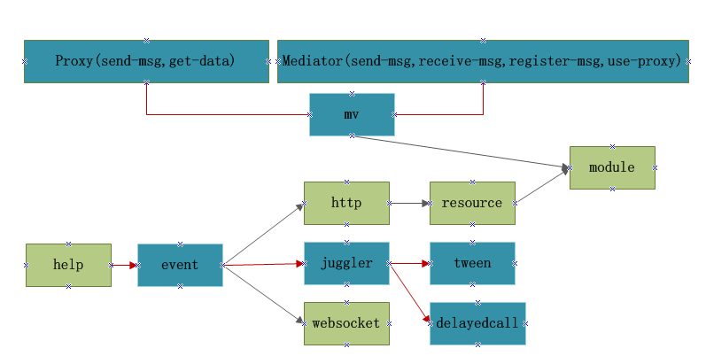

# juggle

juggle是一个JavaScirpt基础库，包含事件、Tween、mv框架、http、websocket、资源、模块等，帮助开发者快速搭建合理的底层结构。

## juggle架构图（深颜色是核心组件强烈推荐，具有不错的特性）

### github地址：

https://github.com/dianbaer/juggle

### 码云地址：

https://gitee.com/dianbaer/basic

# allinone安装

	npm install juggle-all
	
	

# 分开使用

### 1、事件Event

	npm install juggle-event

	juggle-event是一个事件库，可用于解除包含结构，树形结构的耦合性。
	支持冒泡，是构建UI的基石

例子：juggle-event-test

[juggle-event了解更多](./juggle-event)

### 2、动画管理Juggler

	npm install juggle-juggler

	juggle-event是一个动画管理类，可以添加与移除动画。

例子：juggle-juggler-test

[juggle-juggler了解更多](./juggle-juggler)

### 3、动画类Tween

	npm install juggle-tween

	juggle-tween是Tween类，拥有精准的动画。

例子：juggle-tween-test

[juggle-tween了解更多](./juggle-tween)

线上例子地址：

https://www.threecss.com/juggle-tween-test/test.html

### 4、延迟回调DelayedCall

	npm install juggle-delayedcall

	juggle-delayedcalll是一个精准的延迟回调类。

例子：juggle-delayedcall-test

[juggle-delayedcall了解更多](./juggle-delayedcall)

### 5、支持事件派发的websocket客户端

	npm install juggle-websocket

	juggle-websocket是一个支持事件派发的websocket客户端

例子：juggle-websocket-test

websocket服务器（直接可用）：

https://github.com/dianbaer/grain/tree/master/grain-threadwebsocket-test

[juggle-websocket了解更多](./juggle-websocket)

### 6、mv框架

	npm install juggle-mv

	juggle-mv是一个mv框架解除数据源与视图控制器，视图控制器之间的耦合性。

例子：juggle-mv-test

[juggle-mv了解更多](./juggle-mv)

### 7、http客户端

	npm install juggle-http

	juggle-http是可以进行事件派发的httpclient库，可以发文件

例子：juggle-http-test

http服务器（直接可用）：

https://github.com/dianbaer/grain/tree/master/grain-httpserver-test

[juggle-http了解更多](./juggle-http)

### 8、resource资源

	npm install juggle-resource

	juggle-resouce是一个资源库，支持加载多资源回调

例子：juggle-resource-test

[juggle-resource了解更多](./juggle-resource)

### 9、module资源

	npm install juggle-module

	juggle-module是模块类，支持模块加载卸载

例子：juggle-module-test

[juggle-module了解更多](./juggle-module)

### 上传npm包

    npm pack

    npm adduser

    npm publish

	