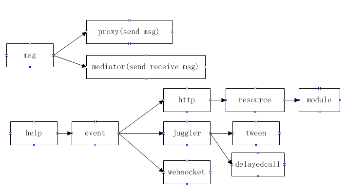

# basic

basic是一个JavaScirpt基础库，包含事件、动画、消息、http、websocket、资源、模块等，帮助开发者快速搭建合理的底层结构。

### 1、事件Event

	npm install basic-event

	basic-event是一个事件库，可用于解除包含结构，树形结构的耦合性。

例子：basic-event-test

[basic-event如何使用](./basic-event)

### 2、动画管理Juggler

	npm install basic-juggler

	basic-event是一个动画管理类，可以添加与移除动画。

例子：basic-juggler-test

[basic-juggler如何使用](./basic-juggler)

### 3、动画类Tween

	npm install basic-tween

	basic-tween是Tween类，拥有精准的动画。

例子：basic-tween-test

[basic-tween如何使用](./basic-tween)

### 4、延迟回调DelayedCall

	npm install basic-delayedcall

	basic-delayedcalll是一个精准的延迟回调类。

例子：basic-delayedcall-test

[basic-delayedcall如何使用](./basic-delayedcall)

### 5、支持事件派发的websocket客户端

	npm install basic-websocket

	basic-websocket是一个支持事件派发的websocket客户端

例子：basic-websocket-test

服务器例子：

https://github.com/dianbaer/grain/tree/master/grain-threadwebsocket-test

[basic-websocket如何使用](./basic-websocket)

### 6、mv框架

	npm install basic-mv

	basic-mv是一个mv框架解除数据源与视图控制器，视图控制器之间的耦合性。

例子：basic-mv-test

[basic-mv如何使用](./basic-mv)

### 上传npm包

    npm pack

    npm adduser

    npm publish

	